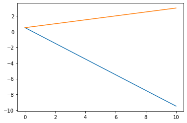
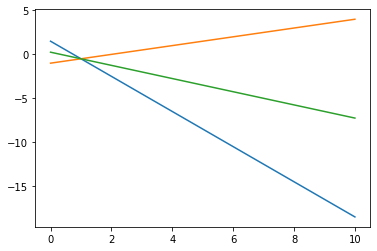

# Sistemas Compatible determinado.

Dado el siguiente sistema calcular su solucion:

$x_1 + x_2 + 2x_3 = 9$

$2x_1+4x_2-3x_3 = 1$

$3x_1+6x_2-5x_3 = 0$

Lo pasasmos a su forma matricial:


```python
import numpy as np
```


```python
A = np.array([[1,1,2],[2,4,-3],[3,6,-5]])
b = np.array([9,1,0])
Ab = np.array([[1,1,2,9],[2,4,-3,1],[3,6,-5,0]])
```

Comprobamos que el rango de A es igual al de Ab , para ver si el sistema es compatible


```python
np.linalg.matrix_rank(A) == np.linalg.matrix_rank(Ab)
```


    True


Ahora comporbamos si es igual al numero de incognitas, para ver si es compatible determinado:


```python
np.linalg.matrix_rank(A) == 3
```


    True


Resolvemos


```python
x = np.linalg.solve(A,b)
x
```


    array([1., 2., 3.])


Comprobamos nuestra solucion :


```python
A.dot(x)
```


    array([9., 1., 0.])


## Representacion de sistemas con Python


```python
import matplotlib.pyplot as plt
```

Dado el sistema :
    
$ 2x_1 + 2x_2 =1 $

$-x_1 + 4x_2 = 2$
    
Lo reescribimos:

$ x_2 = \frac{1}{x} -x_1 $

$x_2 = \frac{2+x_1}{4} $

Su representacion grafica viene dada por:


```python
x1 = np.linspace(0, 10, 100)
plt.plot(x1, 1/2-x1 ,x1, (2+x1)/4)
```


    [<matplotlib.lines.Line2D at 0x113d78e10>,
     <matplotlib.lines.Line2D at 0x113eb25f8>]





```python
#Ejemplo 02
x = np.linspace(0,10,100)
plt.plot(x,3/2-2*x,x,x/2-1,x,(1-3*x)/4)
```


    [<matplotlib.lines.Line2D at 0x113f8b048>,
     <matplotlib.lines.Line2D at 0x113f8b198>,
     <matplotlib.lines.Line2D at 0x113f8b2e8>]





```python

```
