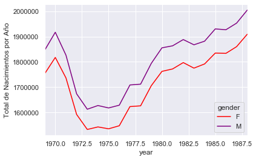
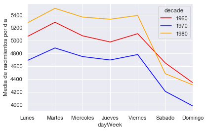
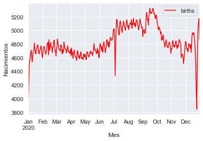

# Analisis de nacimientos en EUA.


## Introduccion:

Hola,soy Fernando Vazquez, estudiante la licenciatura *Matematicas aplicadas & computacion* y me propuse a analizar los datos de un dataset de los nacimientos en estados unidos del año 1963 hasta 2008, inlcuyendo variables aleatorias hasta el 2020,que adquiri en un curso de estadistica con python, a continuacion planteare los objetivos.

## Objetivo:

Analizar el dataframe y responder las siguientes preguntas:
  
  1. Dias con mayor nacimiento.
  
  2. Dias con menor nacimiento.
  
  3. Meses con mayor nacimiento del año 2020.
  

### Material utilizado para el mini proyecto:

  1. Python
  
  2. Watson Studio.
  
  3. Watson Analitycs.
  
  4. Curso estadistica.
  
### **IMPORTANTE:**

A continuacion menciono aspectos importantes a tomar en cuenta:

  1. Ocultare el codigo para que no sea un exceso de paginas.
  
  2. Si quierer abrir el archivo es necesario tener algun notebook como jupyter,skills etc.
  
  3. La informacion es con fines educativos.
  
  4. Las imagenes de Watson Analitycs las adjunto aparte.
  
  5. Disfrutalo :)
  
**BY: FERNANDO VAZQUEZ** 


```python
from PIL import Image
```


```python
import pandas as pd
import numpy as np
import matplotlib.pyplot as plt
import seaborn as sb
%matplotlib inline
```


```python
births = pd.read_csv("/Users/familiavs/Documents/r-basic-master/data/us-births.csv")
```

Vemos cual es la cantidad total de nuestro dataset:


```python
births.shape
```


    (15547, 5)


Comprobamos que nuestros datos se hayan cargado correctamente.


```python
births.head()
```


<div>
<style scoped>
    .dataframe tbody tr th:only-of-type {
        vertical-align: middle;
    }

    .dataframe tbody tr th {
        vertical-align: top;
    }

    .dataframe thead th {
        text-align: right;
    }
</style>
<table border="1" class="dataframe">
  <thead>
    <tr style="text-align: right;">
      <th></th>
      <th>year</th>
      <th>month</th>
      <th>day</th>
      <th>gender</th>
      <th>births</th>
    </tr>
  </thead>
  <tbody>
    <tr>
      <th>0</th>
      <td>1969</td>
      <td>1</td>
      <td>1.0</td>
      <td>F</td>
      <td>4046</td>
    </tr>
    <tr>
      <th>1</th>
      <td>1969</td>
      <td>1</td>
      <td>1.0</td>
      <td>M</td>
      <td>4440</td>
    </tr>
    <tr>
      <th>2</th>
      <td>1969</td>
      <td>1</td>
      <td>2.0</td>
      <td>F</td>
      <td>4454</td>
    </tr>
    <tr>
      <th>3</th>
      <td>1969</td>
      <td>1</td>
      <td>2.0</td>
      <td>M</td>
      <td>4548</td>
    </tr>
    <tr>
      <th>4</th>
      <td>1969</td>
      <td>1</td>
      <td>3.0</td>
      <td>F</td>
      <td>4548</td>
    </tr>
  </tbody>
</table>
</div>


Creamos una tabla pivote con la **informacion que nos interesa reunir** , en este caso año genero y aplicamos la funcion sum.


```python
births.pivot_table('births', index = 'year', columns='gender', aggfunc='sum')
```


<div>
<style scoped>
    .dataframe tbody tr th:only-of-type {
        vertical-align: middle;
    }

    .dataframe tbody tr th {
        vertical-align: top;
    }

    .dataframe thead th {
        text-align: right;
    }
</style>
<table border="1" class="dataframe">
  <thead>
    <tr style="text-align: right;">
      <th>gender</th>
      <th>F</th>
      <th>M</th>
    </tr>
    <tr>
      <th>year</th>
      <th></th>
      <th></th>
    </tr>
  </thead>
  <tbody>
    <tr>
      <th>1969</th>
      <td>1753634</td>
      <td>1846572</td>
    </tr>
    <tr>
      <th>1970</th>
      <td>1819164</td>
      <td>1918636</td>
    </tr>
    <tr>
      <th>1971</th>
      <td>1736774</td>
      <td>1826774</td>
    </tr>
    <tr>
      <th>1972</th>
      <td>1592347</td>
      <td>1673888</td>
    </tr>
    <tr>
      <th>1973</th>
      <td>1533102</td>
      <td>1613023</td>
    </tr>
    <tr>
      <th>1974</th>
      <td>1543005</td>
      <td>1627626</td>
    </tr>
    <tr>
      <th>1975</th>
      <td>1535546</td>
      <td>1618010</td>
    </tr>
    <tr>
      <th>1976</th>
      <td>1547613</td>
      <td>1628863</td>
    </tr>
    <tr>
      <th>1977</th>
      <td>1623363</td>
      <td>1708796</td>
    </tr>
    <tr>
      <th>1978</th>
      <td>1626324</td>
      <td>1711976</td>
    </tr>
    <tr>
      <th>1979</th>
      <td>1705837</td>
      <td>1793958</td>
    </tr>
    <tr>
      <th>1980</th>
      <td>1762459</td>
      <td>1855522</td>
    </tr>
    <tr>
      <th>1981</th>
      <td>1772037</td>
      <td>1863478</td>
    </tr>
    <tr>
      <th>1982</th>
      <td>1797239</td>
      <td>1888218</td>
    </tr>
    <tr>
      <th>1983</th>
      <td>1775299</td>
      <td>1867522</td>
    </tr>
    <tr>
      <th>1984</th>
      <td>1791802</td>
      <td>1881766</td>
    </tr>
    <tr>
      <th>1985</th>
      <td>1834774</td>
      <td>1930290</td>
    </tr>
    <tr>
      <th>1986</th>
      <td>1833708</td>
      <td>1926987</td>
    </tr>
    <tr>
      <th>1987</th>
      <td>1860111</td>
      <td>1953105</td>
    </tr>
    <tr>
      <th>1988</th>
      <td>1909210</td>
      <td>2004583</td>
    </tr>
    <tr>
      <th>1989</th>
      <td>1973712</td>
      <td>2071981</td>
    </tr>
    <tr>
      <th>1990</th>
      <td>2030966</td>
      <td>2131951</td>
    </tr>
    <tr>
      <th>1991</th>
      <td>2011601</td>
      <td>2103741</td>
    </tr>
    <tr>
      <th>1992</th>
      <td>1985118</td>
      <td>2084310</td>
    </tr>
    <tr>
      <th>1993</th>
      <td>1953456</td>
      <td>2051067</td>
    </tr>
    <tr>
      <th>1994</th>
      <td>1932234</td>
      <td>2024691</td>
    </tr>
    <tr>
      <th>1995</th>
      <td>1904871</td>
      <td>1998141</td>
    </tr>
    <tr>
      <th>1996</th>
      <td>1902664</td>
      <td>1992210</td>
    </tr>
    <tr>
      <th>1997</th>
      <td>1896928</td>
      <td>1987401</td>
    </tr>
    <tr>
      <th>1998</th>
      <td>1927106</td>
      <td>2018086</td>
    </tr>
    <tr>
      <th>1999</th>
      <td>1934510</td>
      <td>2028955</td>
    </tr>
    <tr>
      <th>2000</th>
      <td>1984255</td>
      <td>2079568</td>
    </tr>
    <tr>
      <th>2001</th>
      <td>1970770</td>
      <td>2060761</td>
    </tr>
    <tr>
      <th>2002</th>
      <td>1966519</td>
      <td>2060857</td>
    </tr>
    <tr>
      <th>2003</th>
      <td>1999387</td>
      <td>2096705</td>
    </tr>
    <tr>
      <th>2004</th>
      <td>2010710</td>
      <td>2108197</td>
    </tr>
    <tr>
      <th>2005</th>
      <td>2022892</td>
      <td>2122727</td>
    </tr>
    <tr>
      <th>2006</th>
      <td>2084957</td>
      <td>2188268</td>
    </tr>
    <tr>
      <th>2007</th>
      <td>2111890</td>
      <td>2212118</td>
    </tr>
    <tr>
      <th>2008</th>
      <td>2077929</td>
      <td>2177227</td>
    </tr>
  </tbody>
</table>
</div>


Añadimos una columna para agrupar la informacion en decadas.


```python
#Cociente entero
births['decade'] = (births['year']//10)*10
```


```python
births.head()
```


<div>
<style scoped>
    .dataframe tbody tr th:only-of-type {
        vertical-align: middle;
    }

    .dataframe tbody tr th {
        vertical-align: top;
    }

    .dataframe thead th {
        text-align: right;
    }
</style>
<table border="1" class="dataframe">
  <thead>
    <tr style="text-align: right;">
      <th></th>
      <th>year</th>
      <th>month</th>
      <th>day</th>
      <th>gender</th>
      <th>births</th>
      <th>decade</th>
    </tr>
  </thead>
  <tbody>
    <tr>
      <th>0</th>
      <td>1969</td>
      <td>1</td>
      <td>1.0</td>
      <td>F</td>
      <td>4046</td>
      <td>1960</td>
    </tr>
    <tr>
      <th>1</th>
      <td>1969</td>
      <td>1</td>
      <td>1.0</td>
      <td>M</td>
      <td>4440</td>
      <td>1960</td>
    </tr>
    <tr>
      <th>2</th>
      <td>1969</td>
      <td>1</td>
      <td>2.0</td>
      <td>F</td>
      <td>4454</td>
      <td>1960</td>
    </tr>
    <tr>
      <th>3</th>
      <td>1969</td>
      <td>1</td>
      <td>2.0</td>
      <td>M</td>
      <td>4548</td>
      <td>1960</td>
    </tr>
    <tr>
      <th>4</th>
      <td>1969</td>
      <td>1</td>
      <td>3.0</td>
      <td>F</td>
      <td>4548</td>
      <td>1960</td>
    </tr>
  </tbody>
</table>
</div>


Implementamos otra tabla pivote para conseguir nueva informacion , en este caso por genero y decada.


```python
births.pivot_table('births', index='decade', columns='gender', aggfunc='sum')
```


<div>
<style scoped>
    .dataframe tbody tr th:only-of-type {
        vertical-align: middle;
    }

    .dataframe tbody tr th {
        vertical-align: top;
    }

    .dataframe thead th {
        text-align: right;
    }
</style>
<table border="1" class="dataframe">
  <thead>
    <tr style="text-align: right;">
      <th>gender</th>
      <th>F</th>
      <th>M</th>
    </tr>
    <tr>
      <th>decade</th>
      <th></th>
      <th></th>
    </tr>
  </thead>
  <tbody>
    <tr>
      <th>1960</th>
      <td>1753634</td>
      <td>1846572</td>
    </tr>
    <tr>
      <th>1970</th>
      <td>16263075</td>
      <td>17121550</td>
    </tr>
    <tr>
      <th>1980</th>
      <td>18310351</td>
      <td>19243452</td>
    </tr>
    <tr>
      <th>1990</th>
      <td>19479454</td>
      <td>20420553</td>
    </tr>
    <tr>
      <th>2000</th>
      <td>18229309</td>
      <td>19106428</td>
    </tr>
  </tbody>
</table>
</div>


```python
#Configura las tonalitades de color
sb.set()
```

Realizamos nuestro primer grafico representando el total de nacimientos por año asi como el año respectivamente.


```python
colores = ("red","purple")
plt.figure(figsize=(15, 8))
births.pivot_table('births', index='year', columns='gender', aggfunc="sum").plot(color = colores)
plt.ylabel("Total de Nacimientos por Año")
plt.show()
```


    <Figure size 1080x576 with 0 Axes>





Separamos la informacion en **cuartiles**.


```python
quartiles = np.percentile(births['births'], [25,50,75])
med = quartiles[1]
IQR = quartiles[2]-quartiles[0]
sig = 0.75*IQR
cumple.head()
```


<div>
<style scoped>
    .dataframe tbody tr th:only-of-type {
        vertical-align: middle;
    }

    .dataframe tbody tr th {
        vertical-align: top;
    }

    .dataframe thead th {
        text-align: right;
    }
</style>
<table border="1" class="dataframe">
  <thead>
    <tr style="text-align: right;">
      <th></th>
      <th>year</th>
      <th>month</th>
      <th>day</th>
      <th>gender</th>
      <th>births</th>
    </tr>
  </thead>
  <tbody>
    <tr>
      <th>0</th>
      <td>1969</td>
      <td>1</td>
      <td>1.0</td>
      <td>F</td>
      <td>4046</td>
    </tr>
    <tr>
      <th>1</th>
      <td>1969</td>
      <td>1</td>
      <td>1.0</td>
      <td>M</td>
      <td>4440</td>
    </tr>
    <tr>
      <th>2</th>
      <td>1969</td>
      <td>1</td>
      <td>2.0</td>
      <td>F</td>
      <td>4454</td>
    </tr>
    <tr>
      <th>3</th>
      <td>1969</td>
      <td>1</td>
      <td>2.0</td>
      <td>M</td>
      <td>4548</td>
    </tr>
    <tr>
      <th>4</th>
      <td>1969</td>
      <td>1</td>
      <td>3.0</td>
      <td>F</td>
      <td>4548</td>
    </tr>
  </tbody>
</table>
</div>


```python
#Limpiamos un poco los datos.
births = births.query("(births > @med - 5*@sig) & (births < @med + 5*@sig)")
```


```python
births.shape
#Observamos que hay muchos menos datos.
```


    (14610, 6)


## LIMPIEZA DE DATOS:

   1- Transformacion de el dia de nacimiento de tipo entero a tipo fecha.


```python
#Transformacion del dia a entero
births['day'] = births['day'].astype(int)
births.head()
```


<div>
<style scoped>
    .dataframe tbody tr th:only-of-type {
        vertical-align: middle;
    }

    .dataframe tbody tr th {
        vertical-align: top;
    }

    .dataframe thead th {
        text-align: right;
    }
</style>
<table border="1" class="dataframe">
  <thead>
    <tr style="text-align: right;">
      <th></th>
      <th>year</th>
      <th>month</th>
      <th>day</th>
      <th>gender</th>
      <th>births</th>
      <th>decade</th>
    </tr>
  </thead>
  <tbody>
    <tr>
      <th>0</th>
      <td>1969</td>
      <td>1</td>
      <td>1</td>
      <td>F</td>
      <td>4046</td>
      <td>1960</td>
    </tr>
    <tr>
      <th>1</th>
      <td>1969</td>
      <td>1</td>
      <td>1</td>
      <td>M</td>
      <td>4440</td>
      <td>1960</td>
    </tr>
    <tr>
      <th>2</th>
      <td>1969</td>
      <td>1</td>
      <td>2</td>
      <td>F</td>
      <td>4454</td>
      <td>1960</td>
    </tr>
    <tr>
      <th>3</th>
      <td>1969</td>
      <td>1</td>
      <td>2</td>
      <td>M</td>
      <td>4548</td>
      <td>1960</td>
    </tr>
    <tr>
      <th>4</th>
      <td>1969</td>
      <td>1</td>
      <td>3</td>
      <td>F</td>
      <td>4548</td>
      <td>1960</td>
    </tr>
  </tbody>
</table>
</div>


```python
#Implementamos un objeto para poder sacar nuevos datos
births.index = pd.to_datetime(10000*births.year+100*births.month+births.day, format = "%Y%m%d")
```

Podemos observar que ahora nuestro data set tiene un objeto de fecha en lugar de un numero normal


```python

births.head()
```


<div>
<style scoped>
    .dataframe tbody tr th:only-of-type {
        vertical-align: middle;
    }

    .dataframe tbody tr th {
        vertical-align: top;
    }

    .dataframe thead th {
        text-align: right;
    }
</style>
<table border="1" class="dataframe">
  <thead>
    <tr style="text-align: right;">
      <th></th>
      <th>year</th>
      <th>month</th>
      <th>day</th>
      <th>gender</th>
      <th>births</th>
      <th>decade</th>
    </tr>
  </thead>
  <tbody>
    <tr>
      <th>1969-01-01</th>
      <td>1969</td>
      <td>1</td>
      <td>1</td>
      <td>F</td>
      <td>4046</td>
      <td>1960</td>
    </tr>
    <tr>
      <th>1969-01-01</th>
      <td>1969</td>
      <td>1</td>
      <td>1</td>
      <td>M</td>
      <td>4440</td>
      <td>1960</td>
    </tr>
    <tr>
      <th>1969-01-02</th>
      <td>1969</td>
      <td>1</td>
      <td>2</td>
      <td>F</td>
      <td>4454</td>
      <td>1960</td>
    </tr>
    <tr>
      <th>1969-01-02</th>
      <td>1969</td>
      <td>1</td>
      <td>2</td>
      <td>M</td>
      <td>4548</td>
      <td>1960</td>
    </tr>
    <tr>
      <th>1969-01-03</th>
      <td>1969</td>
      <td>1</td>
      <td>3</td>
      <td>F</td>
      <td>4548</td>
      <td>1960</td>
    </tr>
  </tbody>
</table>
</div>


```python
#Creamos una nueva columna para obtener el dia de la semana el cual nacio esa persona
births['dayWeek'] = births.index.dayofweek
```

Creamos una nueva columna para obtener el dia de la semana el cual nacio esa persona.


```python
births.head()
```


<div>
<style scoped>
    .dataframe tbody tr th:only-of-type {
        vertical-align: middle;
    }

    .dataframe tbody tr th {
        vertical-align: top;
    }

    .dataframe thead th {
        text-align: right;
    }
</style>
<table border="1" class="dataframe">
  <thead>
    <tr style="text-align: right;">
      <th></th>
      <th>year</th>
      <th>month</th>
      <th>day</th>
      <th>gender</th>
      <th>births</th>
      <th>decade</th>
      <th>dayWeek</th>
    </tr>
  </thead>
  <tbody>
    <tr>
      <th>1969-01-01</th>
      <td>1969</td>
      <td>1</td>
      <td>1</td>
      <td>F</td>
      <td>4046</td>
      <td>1960</td>
      <td>2</td>
    </tr>
    <tr>
      <th>1969-01-01</th>
      <td>1969</td>
      <td>1</td>
      <td>1</td>
      <td>M</td>
      <td>4440</td>
      <td>1960</td>
      <td>2</td>
    </tr>
    <tr>
      <th>1969-01-02</th>
      <td>1969</td>
      <td>1</td>
      <td>2</td>
      <td>F</td>
      <td>4454</td>
      <td>1960</td>
      <td>3</td>
    </tr>
    <tr>
      <th>1969-01-02</th>
      <td>1969</td>
      <td>1</td>
      <td>2</td>
      <td>M</td>
      <td>4548</td>
      <td>1960</td>
      <td>3</td>
    </tr>
    <tr>
      <th>1969-01-03</th>
      <td>1969</td>
      <td>1</td>
      <td>3</td>
      <td>F</td>
      <td>4548</td>
      <td>1960</td>
      <td>4</td>
    </tr>
  </tbody>
</table>
</div>


```python
#Revisamos que dia de la semana es cada objeto
colores = ("red","blue","orange")
births.pivot_table('births',index='dayWeek', columns='decade',aggfunc="mean").plot(color = colores)
plt.gca().set_xticklabels(['Lunes','Martes','Miercoles','Jueves','Viernes','Sabado','Domingo'])
plt.ylabel("Media de nacimientos por dia")
plt.show()
```





# PUNTO 4 & 5.


## En este grafico podemos ver:

 1. Los dias **sabado y domingo** son los dias con menos nacimientos en las **3 decadas que queriamos saber**.
 
 
 
 2. Los dias **viernes** casualmente son los dias con mas nacimientos de las **3 decadas que queriamos saber**.


```python

births_by_date = births.pivot_table('births', index=[births.index.month, births.index.day], aggfunc="mean")
```

# Punto 6.

Construimos una tabla pivote para ver los nacimientos por dia y por mes.


```python
births_by_date.head()
```


<div>
<style scoped>
    .dataframe tbody tr th:only-of-type {
        vertical-align: middle;
    }

    .dataframe tbody tr th {
        vertical-align: top;
    }

    .dataframe thead th {
        text-align: right;
    }
</style>
<table border="1" class="dataframe">
  <thead>
    <tr style="text-align: right;">
      <th></th>
      <th>births</th>
    </tr>
  </thead>
  <tbody>
    <tr>
      <th>2020-01-01</th>
      <td>4009.225</td>
    </tr>
    <tr>
      <th>2020-01-02</th>
      <td>4247.400</td>
    </tr>
    <tr>
      <th>2020-01-03</th>
      <td>4500.900</td>
    </tr>
    <tr>
      <th>2020-01-04</th>
      <td>4571.350</td>
    </tr>
    <tr>
      <th>2020-01-05</th>
      <td>4603.625</td>
    </tr>
  </tbody>
</table>
</div>


# Respuesta punto 6:

Asi podemos notar que para el dia *1 del mes 1* se obtienen *4009 nacimiento* y asi para cada dia y mes.


```python
color = "red"
plt.figure(figsize=(12,4))
births_by_date.plot(color="red")
plt.ylabel("Nacimientos")
plt.xlabel("Mes")
plt.show()
```


    <Figure size 864x288 with 0 Axes>





```python

```
