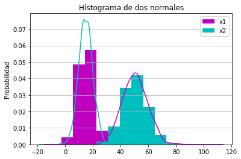
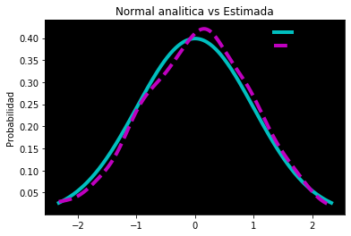
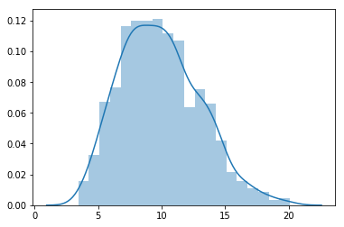
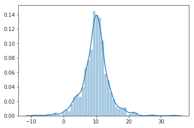
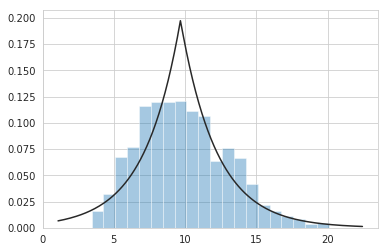

# Funciones de Densidad & Probabilidad.


```python
import pandas as pd
import numpy as np
import matplotlib.pyplot as plt
```


```python
size,scale=1000,10
data = pd.Series(np.random.gamma(scale,size=size))
mu = 15,50
sigma = 5,9
dist = pd.DataFrame(np.random.normal(loc = mu , scale= sigma, size = (1000,2)),columns=["x1","x2"])
```


```python
dist.agg(['min','max','std']).round(decimals = 2)
```


<div>
<style scoped>
    .dataframe tbody tr th:only-of-type {
        vertical-align: middle;
    }

    .dataframe tbody tr th {
        vertical-align: top;
    }

    .dataframe thead th {
        text-align: right;
    }
</style>
<table border="1" class="dataframe">
  <thead>
    <tr style="text-align: right;">
      <th></th>
      <th>x1</th>
      <th>x2</th>
    </tr>
  </thead>
  <tbody>
    <tr>
      <th>min</th>
      <td>-2.73</td>
      <td>17.34</td>
    </tr>
    <tr>
      <th>max</th>
      <td>28.70</td>
      <td>81.63</td>
    </tr>
    <tr>
      <th>std</th>
      <td>5.01</td>
      <td>9.08</td>
    </tr>
  </tbody>
</table>
</div>


```python
# Hacemos un plot de los 2 histogramas
fig,ax = plt.subplots()
col = ("c","m")
col1 = ("m","c")
dist.plot.kde(ax=ax,legend=False,title = "Histograma de dos normales",color = col )
dist.plot.hist(density = True , ax = ax,color=col1)
ax.set_ylabel("Probabilidad")
ax.grid(axis="y",alpha=0.90)
ax.set_facecolor("white")
```





```python
from scipy import stats
```


```python
dist = stats.norm() # Distribucion normal teorica.
#Construimos un muestreo de datos para aproximar la normal de dichos datos
sample = dist.rvs(size=1000)
```


```python
x = np.linspace(start=stats.norm.ppf(0.01),stop=stats.norm.ppf(0.99),num=300)
```


```python
gkds = stats.gaussian_kde(dataset=sample)
```


```python
fig,ax = plt.subplots()
ax.plot(x,dist.pdf(x),linestyle="solid",c="c",lw=4,label="Dis teo")
ax.plot(x,gkds.evaluate(x),linestyle="dashed",c="m",lw=4,label="Dist Kde")
ax.legend(loc="best",frameon=False)
ax.set_title("Normal analitica vs Estimada")
ax.set_ylabel("Probabilidad")
ax.set_facecolor("black")
```





## Contentido extra - (Seaborn)


```python
import seaborn as sb
```


```python
sb.distplot(data)
```


    <matplotlib.axes._subplots.AxesSubplot at 0x7f964f43d208>





```python
x = np.random.laplace(loc=10,scale=3,size=1000)
sb.set_style("ticks", {"xtick.major.size": 8, "ytick.major.size": 8})
sb.distplot(x)
```


    <matplotlib.axes._subplots.AxesSubplot at 0x7f964ecb1e10>





```python
sb.distplot(data,fit=stats.laplace,kde=False)
```


    <matplotlib.axes._subplots.AxesSubplot at 0x7f964ee41da0>





### Calculo de valores no nulos apartir de objetos series.


```python
data2 = np.random.choice(np.arange(10),size=10000,p=np.linspace(1,11,10)/60)
s = pd.Series(data2)
s.value_counts()
```


    9    1938
    8    1651
    7    1415
    6    1197
    5    1065
    4     900
    3     750
    2     560
    1     361
    0     163
    dtype: int64


```python
edad = pd.Series([1,1,2,3,4,5,6,7,8,9,9,5,43,3,34,67,34,75,57,85,23,20])
bins = (0,15,18,30,50,70,100,np.inf)
labels=("bebe","infancia","preadolescencia","adolescencia","adulto","mayor","viejito")
grupos = pd.cut(edad,bins=bins,labels=labels)
grupos
```


    0                bebe
    1                bebe
    2                bebe
    3                bebe
    4                bebe
    5                bebe
    6                bebe
    7                bebe
    8                bebe
    9                bebe
    10               bebe
    11               bebe
    12       adolescencia
    13               bebe
    14       adolescencia
    15             adulto
    16       adolescencia
    17              mayor
    18             adulto
    19              mayor
    20    preadolescencia
    21    preadolescencia
    dtype: category
    Categories (7, object): [bebe < infancia < preadolescencia < adolescencia < adulto < mayor < viejito]


```python
grupos.value_counts()
```


    bebe               13
    adolescencia        3
    mayor               2
    adulto              2
    preadolescencia     2
    viejito             0
    infancia            0
    dtype: int64


```python
#Transformacion de objeto pandas a df
pd.concat((edad,grupos),axis=1).rename(columns={0:'edad',1:'grupo'})
```


<div>
<style scoped>
    .dataframe tbody tr th:only-of-type {
        vertical-align: middle;
    }

    .dataframe tbody tr th {
        vertical-align: top;
    }

    .dataframe thead th {
        text-align: right;
    }
</style>
<table border="1" class="dataframe">
  <thead>
    <tr style="text-align: right;">
      <th></th>
      <th>edad</th>
      <th>grupo</th>
    </tr>
  </thead>
  <tbody>
    <tr>
      <th>0</th>
      <td>1</td>
      <td>bebe</td>
    </tr>
    <tr>
      <th>1</th>
      <td>1</td>
      <td>bebe</td>
    </tr>
    <tr>
      <th>2</th>
      <td>2</td>
      <td>bebe</td>
    </tr>
    <tr>
      <th>3</th>
      <td>3</td>
      <td>bebe</td>
    </tr>
    <tr>
      <th>4</th>
      <td>4</td>
      <td>bebe</td>
    </tr>
    <tr>
      <th>5</th>
      <td>5</td>
      <td>bebe</td>
    </tr>
    <tr>
      <th>6</th>
      <td>6</td>
      <td>bebe</td>
    </tr>
    <tr>
      <th>7</th>
      <td>7</td>
      <td>bebe</td>
    </tr>
    <tr>
      <th>8</th>
      <td>8</td>
      <td>bebe</td>
    </tr>
    <tr>
      <th>9</th>
      <td>9</td>
      <td>bebe</td>
    </tr>
    <tr>
      <th>10</th>
      <td>9</td>
      <td>bebe</td>
    </tr>
    <tr>
      <th>11</th>
      <td>5</td>
      <td>bebe</td>
    </tr>
    <tr>
      <th>12</th>
      <td>43</td>
      <td>adolescencia</td>
    </tr>
    <tr>
      <th>13</th>
      <td>3</td>
      <td>bebe</td>
    </tr>
    <tr>
      <th>14</th>
      <td>34</td>
      <td>adolescencia</td>
    </tr>
    <tr>
      <th>15</th>
      <td>67</td>
      <td>adulto</td>
    </tr>
    <tr>
      <th>16</th>
      <td>34</td>
      <td>adolescencia</td>
    </tr>
    <tr>
      <th>17</th>
      <td>75</td>
      <td>mayor</td>
    </tr>
    <tr>
      <th>18</th>
      <td>57</td>
      <td>adulto</td>
    </tr>
    <tr>
      <th>19</th>
      <td>85</td>
      <td>mayor</td>
    </tr>
    <tr>
      <th>20</th>
      <td>23</td>
      <td>preadolescencia</td>
    </tr>
    <tr>
      <th>21</th>
      <td>20</td>
      <td>preadolescencia</td>
    </tr>
  </tbody>
</table>
</div>


```python

```
